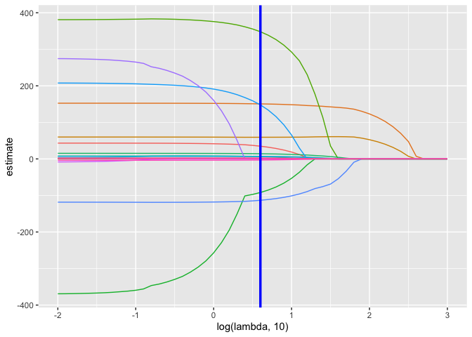
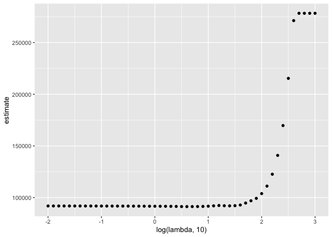

statistical_learning
================

## Lasso

To illustrate the lasso, we’ll data from a study of factors that affect
birthweight. The code chunk below loads and cleans these data, converts
to factors where appropriate, and takes a sample of size 200 from the
result.

``` r
bwt_df = 
  read_csv("./data/birthweight.csv") %>% 
  janitor::clean_names() %>%
  mutate(
    babysex = as.factor(babysex),
    babysex = fct_recode(babysex, "male" = "1", "female" = "2"),
    frace = as.factor(frace),
    frace = fct_recode(frace, "white" = "1", "black" = "2", "asian" = "3", 
                       "puerto rican" = "4", "other" = "8"),
    malform = as.logical(malform),
    mrace = as.factor(mrace),
    mrace = fct_recode(mrace, "white" = "1", "black" = "2", "asian" = "3", 
                       "puerto rican" = "4")) %>% 
  sample_n(200)
```

    ## Rows: 4342 Columns: 20
    ## ── Column specification ────────────────────────────────────────────────────────
    ## Delimiter: ","
    ## dbl (20): babysex, bhead, blength, bwt, delwt, fincome, frace, gaweeks, malf...
    ## 
    ## ℹ Use `spec()` to retrieve the full column specification for this data.
    ## ℹ Specify the column types or set `show_col_types = FALSE` to quiet this message.

To fit a lasso model, we’ll use glmnet. This package is widely used and
broadly useful, but predates the tidyverse by a long time. The interface
asks for an outcome vector y and a matrix of predictors X, which are
created next. To create a predictor matrix that includes relevant dummy
variables based on factors, we’re using model.matrix and excluding the
intercept

Inputs for `glmnet`

``` r
x = model.matrix(bwt ~ ., bwt_df)[,-1]
y = bwt_df$bwt
```

We *fit the lasso model* for each tuning parameter in a pre-defined grid
`lambda`, and then compare the fits using cross validation. I chose this
grid using the trusty “try things until it looks right” method; glmnet
will pick something reasonable by default if you prefer that.

Set lambda, if not R will set for you.

``` r
lambda = 10^(seq(3, -2, -0.1))

# as lambda decreases, number of predictors increases
lasso_fit =
  glmnet(x, y, lambda = lambda)

# cv equals cross validation...
lasso_cv =
  cv.glmnet(x, y, lambda = lambda)

# saves best lambda (best prediction accuracy)
lambda_opt = lasso_cv$lambda.min
```

The plot below shows coefficient estimates corresponding to a subset of
the predictors in the dataset – these are predictors that have non-zero
coefficients for at least one tuning parameter value in the pre-defined
grid. As lambda increases, the coefficient values are shrunk to zero and
the model becomes more sparse. The optimal tuning parameter, determined
using cross validation, is shown by a vertical blue line.

Purpose: lasso shrinks coefficients down, blue line is optimal parameter
through cross validation.

``` r
broom::tidy(lasso_fit) %>% 
  select(term, lambda, estimate) %>% 
  complete(term, lambda, fill = list(estimate = 0) ) %>% 
  filter(term != "(Intercept)") %>% 
  ggplot(aes(x = log(lambda, 10), y = estimate, group = term, color = term)) + 
  geom_path() + 
  geom_vline(xintercept = log(lambda_opt, 10), color = "blue", size = 1.2) +
  theme(legend.position = "none")
```

<!-- -->

The next plot shows the CV curve itself. This is relatively shallow –
having nothing at all in your model isn’t great, but you can get
reasonable predictions from models that have “too many” predictors.

``` r
broom::tidy(lasso_cv) %>% 
  ggplot(aes(x = log(lambda, 10), y = estimate)) + 
  geom_point() 
```

<!-- -->

The coefficients from the optimal model are shown below.

``` r
lasso_fit = 
  glmnet(x, y, lambda = lambda_opt)

lasso_fit %>% broom::tidy()
```

    ## # A tibble: 16 × 5
    ##    term               step  estimate lambda dev.ratio
    ##    <chr>             <dbl>     <dbl>  <dbl>     <dbl>
    ##  1 (Intercept)           1 -6277.      3.98     0.728
    ##  2 babysexfemale         1    34.9     3.98     0.728
    ##  3 bhead                 1   151.      3.98     0.728
    ##  4 blength               1    59.3     3.98     0.728
    ##  5 delwt                 1     0.963   3.98     0.728
    ##  6 fincome               1     0.198   3.98     0.728
    ##  7 fraceasian            1   348.      3.98     0.728
    ##  8 fracepuerto rican     1   -91.9     3.98     0.728
    ##  9 gaweeks               1    14.2     3.98     0.728
    ## 10 menarche              1     6.12    3.98     0.728
    ## 11 mheight               1     6.93    3.98     0.728
    ## 12 momage                1     6.36    3.98     0.728
    ## 13 mraceblack            1  -113.      3.98     0.728
    ## 14 mraceasian            1   148.      3.98     0.728
    ## 15 smoken                1    -2.99    3.98     0.728
    ## 16 wtgain                1     2.42    3.98     0.728

## Clustering: pokemon
